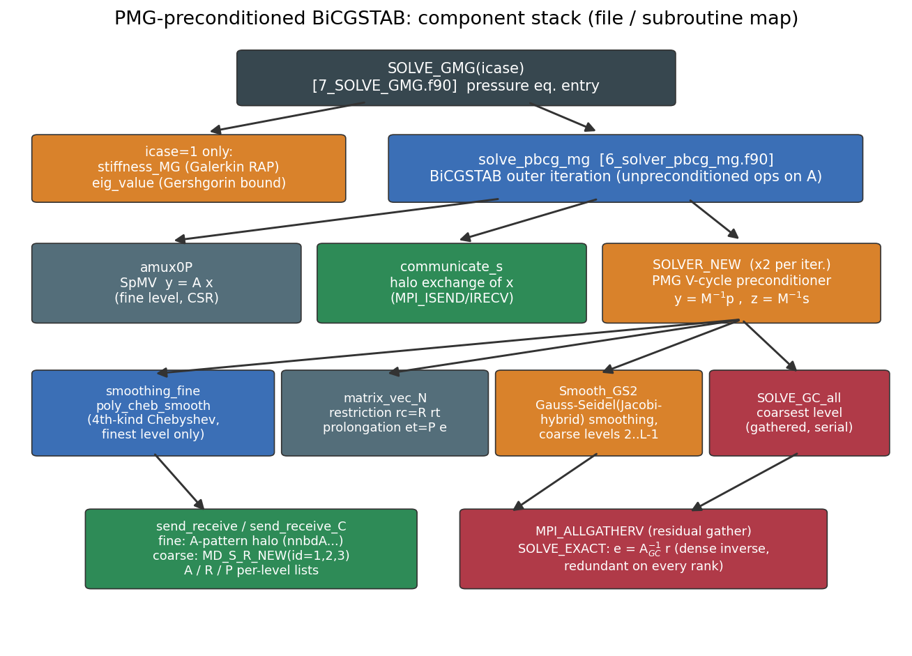
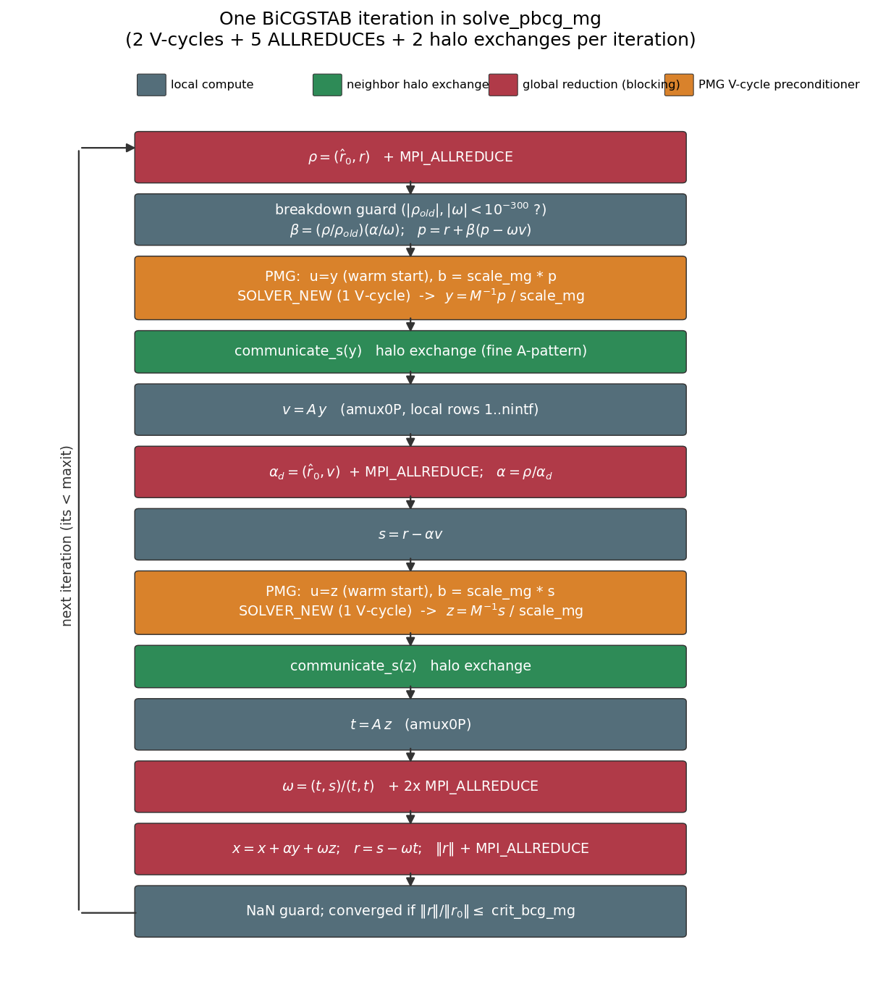

# 01. 전체 구조 — PMG 예조건화 BiCGSTAB

> 대상 코드: `code/Source/GMG/` (분석 기준: 클리닝 D5, 2026-08)
> 핵심 파일: `7_SOLVE_GMG.f90`, `6_solver_pbcg_mg.f90`, `1_read_input.f90`

## 1.1 한 줄 요약

CUPID 압력(보정) 방정식 `A p' = b` 를 **BiCGSTAB 외부 반복 + 기하학적 병렬 멀티그리드(PMG) V-cycle 1회를 예조건자 M⁻¹로** 사용하여 푼다. 계층은 좌표 거리 기반 semi-coarsening 으로 구성하고, 최조(coarsest) 레벨은 전 랭크에 **중복 수집(gather-to-all)** 하여 통신 없이 직접 해를 구한다.



## 1.2 진입점: `SOLVE_GMG(icase)` — [7_SOLVE_GMG.f90:1](../../code/Source/GMG/7_SOLVE_GMG.f90#L1)

```
SOLVE_GMG(icase)
 ├─ ut = u                        (백업: 발산 시 복원용)
 ├─ Dig_mdf_matrix(icase)        (행 대각 스케일링: A ← D⁻¹A, b ← D⁻¹b)
 ├─ [icase==1] stiffness_MG      (Galerkin RAP: 모든 코어스 행렬 auc 재계산)
 ├─ [icase==1] eig_value         (Gershgorin 행합 → Chebyshev 스펙트럼 상계)
 ├─ solve_pbcg_mg(ierr)          (BiCGSTAB 본체)
 └─ [ierr==1] u←ut 복원, mdf_matrix 토글 후 1회 재시도; 2회 실패 시 STOP
```

- `icase=1`: 행렬이 새로 조립된 경우 → RAP 재계산 필요. `icase=2`: 행렬 불변(비직교 보정 2차 호출 등) → RAP 재사용. 현재 CUPID 연동에서는 `icase_MG=2` 고정([1_read_input.f90:44](../../code/Source/GMG/1_read_input.f90#L44)).
- **대각 스케일링** `Dig_mdf_matrix` ([7_SOLVE_GMG.f90:281](../../code/Source/GMG/7_SOLVE_GMG.f90#L281)): `mdf_matrix=1` 이면 각 행을 대각으로 나눠 `diag(A)=1` 로 만든다. 발산 시(`ierr=1`) `mdf_matrix` 를 토글하고 `Dig_mdf_matrix_inv` 로 원상 복구 후 재시도하는 **자가 복구 루프**가 있다 ([7_SOLVE_GMG.f90:37-98](../../code/Source/GMG/7_SOLVE_GMG.f90#L37-L98)).

## 1.3 BiCGSTAB 외부 반복 — [6_solver_pbcg_mg.f90](../../code/Source/GMG/6_solver_pbcg_mg.f90)

표준 우예조건(right-preconditioned) BiCGSTAB 이며, 반복당 **예조건자(V-cycle) 2회, SpMV 2회, ALLREDUCE 5회, halo 교환 2회**를 수행한다.



코드 특이사항 (수식 대비):

| 항목 | 코드 | 위치 |
|---|---|---|
| 예조건 적용 | `u=y0; b=scale_mg*p0; CALL SOLVER_NEW` → `y0=u/scale_mg` | [6_solver_pbcg_mg.f90:151-164](../../code/Source/GMG/6_solver_pbcg_mg.f90#L151-L164) |
| **warm start** | 직전 반복의 `y0`/`z0` 를 V-cycle 초기 추정치로 재사용 (첫 반복은 0 초기화 — C011-3r1 결정화 수정) | [:42-47](../../code/Source/GMG/6_solver_pbcg_mg.f90#L42-L47) |
| **scale_mg** | 우변을 10¹→10¹⁰ 까지 반복마다 ×10 스케일업 후 해를 역스케일 — V-cycle 내부의 절대 잔차 판정(`res0 ≤ 1e-16` 조기 종료, [7_SOLVE_GMG.f90:444](../../code/Source/GMG/7_SOLVE_GMG.f90#L444))을 피해 작은 우변에서도 V-cycle 이 실제로 돌게 하는 장치 | [:34, :151-153](../../code/Source/GMG/6_solver_pbcg_mg.f90#L151-L153) |
| breakdown 가드 | `|ρ_old|,|ω|,|α_d| < 1e-300` → `ierr=1` 탈출; `ro≠ro` NaN 가드 | [:136, :188, :262](../../code/Source/GMG/6_solver_pbcg_mg.f90#L136) |
| 수렴 판정 | `‖r‖/‖r₀‖ ≤ crit_bcg_mg` (CUPID의 `eps_bicg` 상속) | [:263](../../code/Source/GMG/6_solver_pbcg_mg.f90#L263) |

주목할 점: **예조건자가 매 반복 동일하지 않다**(warm start + V-cycle 내부 수렴 판정 `crit=0.1` 조기 탈출 가능) — 엄밀히는 가변(flexible) 예조건이며, 논문 초안의 FBiCGSTAB 논의와 연결되는 지점이다.

## 1.4 예조건자 = V-cycle 1회

`SOLVER_NEW` ([7_SOLVE_GMG.f90:379](../../code/Source/GMG/7_SOLVE_GMG.f90#L379)) 는 `ncycle=1` 로 V-cycle 을 1회만 돌고 반환한다(예조건자 모드, [1_read_input.f90:59](../../code/Source/GMG/1_read_input.f90#L59)). 내부 판정 `crit=1e-1` 은 사실상 1 사이클 안에 만족되지 않으므로 "고정 1 V-cycle 예조건자"로 동작한다. V-cycle 상세는 [03_vcycle_smoothers.md](03_vcycle_smoothers.md).

## 1.5 고정 구성과 튜닝 파라미터

클리닝 P5 이후 코드 상수로 고정된 구성 ([1_read_input.f90:42-55](../../code/Source/GMG/1_read_input.f90#L42-L55)):

| 상수 | 값 | 의미 |
|---|---|---|
| `mdf_matrix` | 1 | 행 대각 스케일링 사용 |
| `n_GC` | 1 | Global-Coarse 레벨 사용 |
| `i_dir` | 1 | GC 직접해 = 밀집 역행렬 `Ainv` (전 랭크 중복) |
| `icommu` | 2 | (셋업 행렬 통신 모드) |
| `igather` | 1 | GC 수집 = `MPI_ALLGATHERV` (ALLREDUCE 아님) |
| `ncycle` | 1 | 예조건자 적용당 V-cycle 수 |
| `n1_min` | 100 | 조대화 정지: 전역 노드 ≤ 100 |

`mg.in` 으로 조정 가능한 파라미터 (기본값):

| 파라미터 | 기본 | 역할 | 사용처 |
|---|---|---|---|
| `teta` | 0.6 | 조대화 반경 배율 (작을수록 공격적) | `coarsening_semi` |
| `teta_p` | 0.65 | 보간 이웃 거리 필터 | `reduce_neibor` |
| `alpha` | 0.005 | P 행렬 드롭 톨러런스 | `reduce_CSR_matrix` |
| `itergs(l)` | 1,1,2,… | 레벨별 스무딩 횟수 (미지정 레벨은 직전 값 상속) | V-cycle |
| `icheb(1)` | 2 | fine 레벨 Chebyshev 반복 수 | `poly_cheb_smooth` |
| `ip_nmax` | 4 | 보간 이웃 최대 수 | `reduce_neibor` |
| `ip_inter` | 1 | 보간 방식 (1=역거리, 2=선형/barycentric) | `interpolation.f90` |
| `ip_lev` | 1 | 보간 후보 탐색 링 수 | `neighboring.f90` |
| `il1_gs` | 0 | 코어스 GS 대각의 l1 보정 (파티션 무관 수렴) | `stiffness_MG` |
| `nthre` | 1 | OpenMP 스레드 수 | 전역 |

레벨 수는 자동 결정: `nlevel ≤ 20 - nlv_glomax`, `nlv_glomax` 는 랭크 수에 따라 0(≤10) / 1(≤50) / 2(≤1000) / 3 ([1_read_input.f90:90-103](../../code/Source/GMG/1_read_input.f90#L90-L103)). 실제 정지는 전역 노드 수 ≤ `n1_min` ([02_setup_hierarchy.md](02_setup_hierarchy.md) §6).

## 1.6 문서 구성

| 문서 | 내용 |
|---|---|
| [02_setup_hierarchy.md](02_setup_hierarchy.md) | 조대화, 보간 P/제한 R, Galerkin RAP, 레벨 저장 구조, GC 구성 |
| [03_vcycle_smoothers.md](03_vcycle_smoothers.md) | V-cycle 단계별 해부, Chebyshev/GS 스무더, 최조 레벨 해법 |
| [04_parallelization.md](04_parallelization.md) | 도메인 분할, halo 교환, A/R/P 통신 패턴, 데이터 이동 경로 전체 |
| [05_demo2d.md](05_demo2d.md) | 2차원 미니어처 구현으로 각 과정 가시화 |
