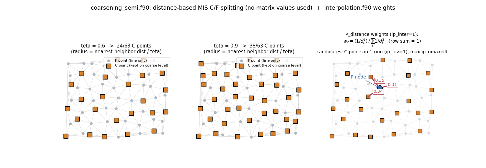
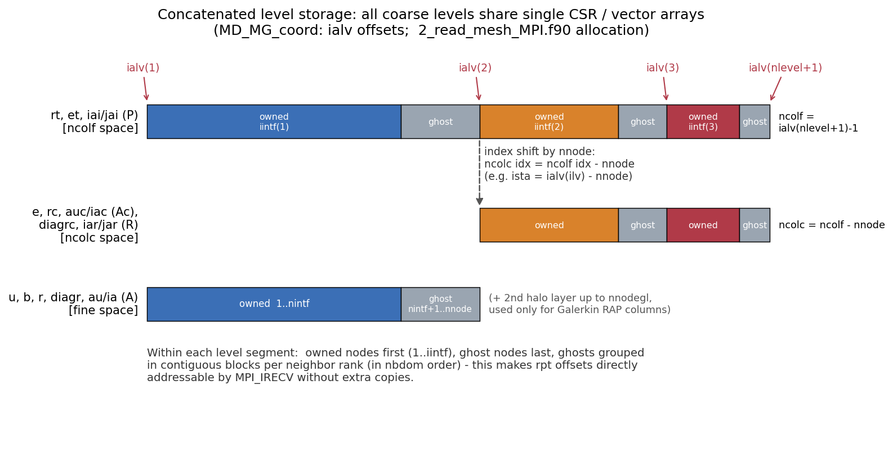

# 02. 계층 구성 (Setup) — 조대화 · 보간 · Galerkin RAP · 저장 구조

> 핵심 파일: `coarsening_semi.f90`, `interpolation.f90`, `neighboring.f90`, `5_PREP_GMG.f90`,
> `stiffness_MG.f90`, `5_PREP_GMG_global_coarse.f90`, `stiffness_GC.f90`, `6_subdomain_infor_mg.f90`

## 2.1 셋업 파이프라인: "직렬 심볼릭 + 병렬 수치"

셋업은 두 부분으로 나뉜다. **조대화·P/R 구성·희소패턴은 rank 0 이 전역 메쉬 위에서 직렬로 1회** 수행하고, 각 랭크는 자기 몫만 받아온다. **행렬 값(RAP)만 매번 병렬로** 계산한다.

| 단계 | 위치 | 실행 주체 |
|---|---|---|
| `subdomain_infor_MG` → `PREP_GMG` (조대화 + P/R + Ac 패턴) | [6_subdomain_infor_mg.f90:64](../../code/Source/GMG/6_subdomain_infor_mg.f90#L64) | **rank 0 단독** |
| 레벨별 분할 정보 기록 (`part_MG###.out` 파일 또는 MPI 스테이징) | [6_subdomain_infor_mg.f90:362-834](../../code/Source/GMG/6_subdomain_infor_mg.f90#L362-L834) | rank 0 |
| `read_mesh_MPI` (랭크별 슬라이스 수신·재조립) | [2_read_mesh_MPI.f90](../../code/Source/GMG/2_read_mesh_MPI.f90) | 전 랭크 |
| `Prep_fine_P` / `Prep_MG_GarL` (고스트 행 CSR 패턴 통신) | [3_Prep_fine_P.f90](../../code/Source/GMG/3_Prep_fine_P.f90), [4_Prep_MG_GarL.f90](../../code/Source/GMG/4_Prep_MG_GarL.f90) | 전 랭크 |
| `stiffness_MG` (RAP 수치) | [7_SOLVE_GMG.f90:59](../../code/Source/GMG/7_SOLVE_GMG.f90#L59) — **솔브 시점**, `icase==1` 일 때만 | 전 랭크 |

분배는 이중 모드: `isetup_comm=0` 이면 `MG_tmp/` 파일 경유, `=1` 이면 `MPI_SCATTERV` 스테이징 버퍼 경유 (LOOP C011 작업, [MD_MG_index.f90:21-38](../../code/Source/GMG/module/MD_MG_index.f90#L21-L38)).

## 2.2 조대화: 좌표 거리 기반 MIS C/F 분할 — `coarsening_semi.f90`

**행렬 계수는 전혀 쓰지 않는다.** 인접 그래프 `(ia,ja)` 와 좌표 `coord` 만 사용하는 기하학적 MIS(maximal independent set) 알고리즘이다 ([coarsening_semi.f90:9-11](../../code/Source/GMG/coarsening_semi.f90#L9-L11)). classical AMG 의 strength-of-connection(θ·|a_ij|max) 과 혼동하지 말 것.

```
for j = 1..nnodf (순서대로):
    if 미분류(j):
        j 를 C 로 확정                                    # :41-42
        dmin = min_k |x_j - x_k|  (그래프 이웃 k)          # :64-83
        dmin ← dmin / teta                                # :85  ← teta 의 유일한 역할
        모든 미분류 이웃 id 중 |x_j - x_id| ≤ dmin → F     # :93-94
# 후처리: 이웃에 C 가 하나도 없는 F 는 C 로 승격            # :126-136
```

- **`teta` = 조대화 반경 배율.** `teta=0.6` 이면 반경 = 최근접거리 × 1.67. teta ↓ → 반경 ↑ → C 점 감소(공격적 조대화), teta ↑ → C 점 증가.
- **고립 F 승격**: 보간 분모가 비는 것을 방지 ("no connection" 처리).
- **용량 가드**: 호출측이 `nnode2 = INT(0.6*nnode1)` 로 코어스 배열을 예약하는데([5_PREP_GMG.f90:109-110](../../code/Source/GMG/5_PREP_GMG.f90#L109-L110)), MIS 결과가 이를 넘으면 `STOP` ([coarsening_semi.f90:149-152](../../code/Source/GMG/coarsening_semi.f90#L149-L152)). 즉 조대화율이 0.6 보다 나쁘면 죽는다.



*그림: `coarsening_semi` 알고리즘을 그대로 재현한 2D 예시. teta 가 클수록 C 점이 많아진다(가운데). 오른쪽: F 점의 보간 이웃(1-ring 의 C 점, 최대 `ip_nmax=4`)과 역거리 가중치.*

## 2.3 보간 연산자 P — `neighboring.f90` + `interpolation.f90`

구성은 3단계: **(후보 선택) → (후보 축소) → (가중치 계산) → (드롭)**.

### (1) 후보 선택 — `ip_lev`
- `ip_lev=1` (기본): F 점의 **1-ring 그래프 이웃 중 C 점**만 후보 (`neighbor_fine_graph`, [neighboring.f90:347](../../code/Source/GMG/neighboring.f90#L347)). C 점 자신은 단일 엔트리(injection).
- `ip_lev=2`: 1-ring 에 C 가 없으면 2-ring 까지 확장 (`neighbor_fine_graph2`, [neighboring.f90:422](../../code/Source/GMG/neighboring.f90#L422)).

### (2) 후보 축소 — `reduce_neibor` ([neighboring.f90:689](../../code/Source/GMG/neighboring.f90#L689))
- `teta_p`: 거리 필터. `dmin ← dmin/teta_p` 후 그 안의 후보만 유지 ([:770-785](../../code/Source/GMG/neighboring.f90#L770-L785)).
- `ip_nmax`: 행당 최대 엔트리 하드캡. 초과 시 가까운 순 `ip_nmax` 개만 유지 ([:790-812](../../code/Source/GMG/neighboring.f90#L790-L812)).

### (3) 가중치 — `ip_inter`
- **`ip_inter=1` (기본) → `P_distance`** ([interpolation.f90:3](../../code/Source/GMG/interpolation.f90#L3)): 역거리(제곱) 가중.
  `dx_i = |x_F − x_{C_i}|²` 에 대해 `w_i = (1/dx_i) / Σ_j (1/dx_j)` — 구현은 곱 형태 `dd(i)=Π_{j≠i}dx(j); w=dd/Σdd` ([:49-58](../../code/Source/GMG/interpolation.f90#L49-L58)). **행합 = 1** (partition of unity). C 점은 `w=1` injection.
- **`ip_inter=2` → `P_linear_2D/3D`**: 거리순 정렬 후 삼각형(2D)/사면체(3D)를 만들어 내부 판정(`check_node`) 통과 시 **면적/부피 좌표(barycentric) shape function** ([:159-167](../../code/Source/GMG/interpolation.f90#L159-L167)), 실패 시 2점 선형 폴백.

### (4) 드롭 — `reduce_CSR_matrix` ([5_PREP_GMG.f90:542](../../code/Source/GMG/5_PREP_GMG.f90#L542))
`|P_ij| ≥ alpha`(기본 0.005)만 유지하고 CSR 압축. **주의: 드롭 후 행 재정규화를 하지 않으므로** 행합이 1에서 alpha 수준으로 어긋난다(상수 벡터 보존 근사 파손 — 논문 서술 시 언급 가치).

## 2.4 제한 연산자 R = Pᵀ (정확히)

```fortran
CALL mt_trans(nnode1, nnode2, nnzi1, iai1, jai1, iar1, jar1, Xintp1, Xrest1)
```
`mt_trans` ([mt_trans.f90:4](../../code/Source/GMG/mt_trans.f90#L4))는 값 스케일링 없는 순수 CSR 전치다 ([5_PREP_GMG.f90:291-294](../../code/Source/GMG/5_PREP_GMG.f90#L291-L294)). 따라서 코어스 행렬은 **진짜 Galerkin 곱 `Ac = Pᵀ A P`** 이다.

## 2.5 Galerkin RAP — `stiffness_MG.f90` (병렬 수치 단계)

`stiff_coarse_P` ([stiffness_MG.f90:243](../../code/Source/GMG/stiffness_MG.f90#L243))는 행 단위 SpGEMM:

```
(통신) fine 레벨 고스트 행의 au 값 수신                     # :107-121, send_receive_mt 계열
for I = 1..nintf1  (소유 코어스 행만):                     # :311
    vi(:) = Σ_k R(I,k) · Af(k,:)      # 밀집 accumulator   # :319-328
    for J ∈ pattern(Ac 행 I):
        Ac(I,J) = Σ_l vi(nj(l)) · R(J,l)                  # :341-350
    vi 리셋 (touched 엔트리만)                              # :354-360
```

- `vi` 는 fine 로컬 전체 크기(`nnodegl`)의 밀집 배열, OpenMP `firstprivate` 로 스레드별 사본.
- **소유 행만 계산** — 고스트 행 값은 다음 레벨 RAP 직전에 `MD_S_R_MT` 통신으로 수신 (owner-computes).
- RAP 에 필요한 "고스트 행의 열 인덱스"가 로컬 번호를 가져야 하므로 **2층 halo(`nnodegl > nnode`)** 까지 번호를 부여해 둔다 ([04_parallelization.md](04_parallelization.md) §4.1).
- 부수 산출물: 코어스 GS 용 역대각 `diagrc = 1/a_ii`. `il1_gs=1` 이면 고스트 열 `Σ|a_ij|` 를 대각에 가산하는 **l1-GS 보정**(Baker et al. 2011, 파티션 무관 수렴 보장) ([stiffness_MG.f90:176-189](../../code/Source/GMG/stiffness_MG.f90#L176-L189)).

> **→ 병렬 RAP 를 1D 수치 예제로 따라가는 상세 해설: [06_rap_parallel_example.md](06_rap_parallel_example.md)**

## 2.6 레벨 저장 구조: 단일 연접 배열 + `ialv` 오프셋

모든 코어스 레벨이 하나의 긴 배열을 공유한다 ([2_read_mesh_MPI.f90:479-486](../../code/Source/GMG/2_read_mesh_MPI.f90#L479-L486)).



| 변수 | 의미 |
|---|---|
| `ialv(ilv)` | 레벨 ilv 세그먼트 시작 오프셋 (ncolf 공간 기준) |
| `iintf(ilv)` | 레벨 ilv 의 **소유** 노드 수 (그 뒤는 고스트) |
| `ncolf = ialv(nlevel+1)-1` | 전 레벨 노드 총합 → `rt, et, iai/jai(P)` 크기 |
| `ncolc = ncolf - nnode` | 코어스 레벨(2..nlevel) 총합 → `e, rc, auc/iac, diagrc, iar/jar(R)` 크기 |

V-cycle 코드에 반복 등장하는 `ista = ialv(ilv) - nnode` 는 **ncolf 공간 오프셋을 ncolc 공간 인덱스로 변환**하는 것이다 ([7_SOLVE_GMG.f90:500 vs :573](../../code/Source/GMG/7_SOLVE_GMG.f90#L500)). 두 공간을 오가는 명시적 변환: `e(i) = e(i) + et(i+nnode)` ([:576-583](../../code/Source/GMG/7_SOLVE_GMG.f90#L576-L583)).

연접 시 열 인덱스 시프트 규칙: Ac 는 행·열 모두 ncolc 공간(`+ncolc2`), P 는 행 ncolf/열 ncolc, R 는 행 ncolc/열 ncolf ([5_PREP_GMG.f90:332-391](../../code/Source/GMG/5_PREP_GMG.f90#L332-L391)).

## 2.7 레벨 수 결정

- 상한: `nlevel = 20 - nlv_glomax` ([1_read_input.f90:90-103](../../code/Source/GMG/1_read_input.f90#L90-L103)).
- 실제 정지 (`opt_level`, [5_PREP_GMG.f90:616-647](../../code/Source/GMG/5_PREP_GMG.f90#L616-L647)): **전역 코어스 노드 수 ≤ `n1_min`(=100) 이 되는 레벨**에서 로컬 계층을 끊는다. `nnode2==1` 도 즉시 정지.
- 이후 `nlevel_N` 에서 `nlv_glo` 를 빼서, 남은 레벨은 전역(GC) 계층이 이어받는다 ([5_PREP_GMG.f90:498-503](../../code/Source/GMG/5_PREP_GMG.f90#L498-L503)).
- rank 0 이 결정한 `nlevel_N`, `nlv_glo` 는 `MPI_BCAST` 로 전파 ([2_read_mesh_MPI.f90:57-69](../../code/Source/GMG/2_read_mesh_MPI.f90#L57-L69)).

## 2.8 Global Coarse(GC) 구성

로컬 최조 레벨(크기 `nnods`, 소유 `nintfs`) 아래에 **전역 행렬을 전 랭크가 중복 보유**하는 GC 층이 붙는다.

1. **패턴**: rank 0 이 전역 최조 CSR(`iaG/jaG`, 크기 `nnodeG/nnzG`)과 로컬→전역 매핑 `imapG` 를 모든 랭크 몫으로 기록 ([6_subdomain_infor_mg.f90:739-782](../../code/Source/GMG/6_subdomain_infor_mg.f90#L739-L782)). 모든 랭크가 전역 패턴 전체를 가진다.
2. **값 조립** (`stiffness_GC_all`, [stiffness_GC.f90:3](../../code/Source/GMG/stiffness_GC.f90#L3)): `igather=1` 기본 경로는 `MPI_ALLGATHERV(au…)` 후 셋업 시 1회 구축한 순열 `imapgatA` 로 재배치. (대안 `igather=0`: `imapGZ` scatter + `MPI_ALLREDUCE(SUM)` — 전송량 `nnzG`.)
3. **추가 전역 조대화** (`nlv_glo>0`): `PREP_GMG_global_coarse` ([5_PREP_GMG_global_coarse.f90](../../code/Source/GMG/5_PREP_GMG_global_coarse.f90))가 §2.2~2.4 와 **동일한 루틴으로** 전역 행렬을 `nlv_glo` 레벨 더 조대화한다. 통신 없음 — **전 랭크 중복 계산**. 저장은 연접 배열이 아닌 2D 배열(`iaGC(:,ilv)` 등).
4. **직접해 준비** (`STIFF_EXACT`, [stiffness_GC.f90:123](../../code/Source/GMG/stiffness_GC.f90#L123)): 최종 레벨 행렬을 밀집으로 펼쳐 **역행렬 `Ainv` 를 명시적으로 구성** (`linalg_invM`).

GC 런타임 동작(수집·해·복사)은 [03](03_vcycle_smoothers.md) §3.4, 통신 상세는 [04](04_parallelization.md) §4.7 참조.
