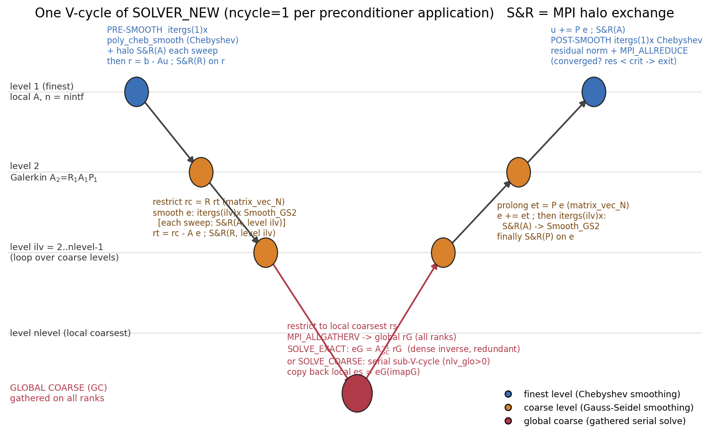
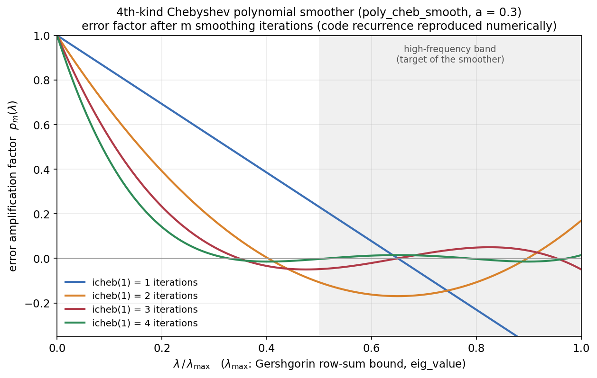

# 03. V-cycle 과 스무더

> 핵심 파일: `7_SOLVE_GMG.f90` (`SOLVER_NEW`), `poly_smooth.f90`, `Relax_GSP.f90`, `SOLVE_GC.f90`

## 3.1 V-cycle 전체 흐름 — `SOLVER_NEW` ([7_SOLVE_GMG.f90:379](../../code/Source/GMG/7_SOLVE_GMG.f90#L379))



한 사이클의 단계별 코드 대응 (S&R = halo 교환, 패턴 A/R/P 는 [04](04_parallelization.md) §4.5):

| # | 단계 | 연산 | 통신 | 코드 |
|---|---|---|---|---|
| 0 | 초기화 | `S&R(A)` on u → `res0 = ‖b−Au‖` | halo + ALLREDUCE | [:424-440](../../code/Source/GMG/7_SOLVE_GMG.f90#L424-L440) |
| 1 | 프리 스무딩 (fine) | Chebyshev `itergs(1)`회 | 스윕마다 halo(A) | [:462](../../code/Source/GMG/7_SOLVE_GMG.f90#L462) |
| 2 | fine 잔차 | `r = b − Au` (소유 행만) → `rt=r` | `S&R(R)` on r | [:468-481](../../code/Source/GMG/7_SOLVE_GMG.f90#L468-L481) |
| 3 | 하향 (ilv=2..L−1) | `rc = R·rt` → GS `itergs(ilv)`회 → `rt = rc − A·e` | 스윕마다 `MD_S_R_NEW(A)`, 잔차 후 `MD_S_R_NEW(R)` | [:491-533](../../code/Source/GMG/7_SOLVE_GMG.f90#L491-L533) |
| 4 | 최조 (ilv=L) | `rc = R·rt` → `rs` 복사 → `SOLVE_GC_all` | ALLGATHERV (내부) | [:536-550](../../code/Source/GMG/7_SOLVE_GMG.f90#L536-L550) |
| 5 | 상향 (ilv=L−1..2) | `et = P·e` → `e += et` → GS `itergs(ilv)`회 | 스윕 전 `MD_S_R_NEW(A)`, 마지막에 `MD_S_R_NEW(P)` | [:565-610](../../code/Source/GMG/7_SOLVE_GMG.f90#L565-L610) |
| 6 | fine 보정 | `u += P·e` | `S&R(A)` on u | [:614-631](../../code/Source/GMG/7_SOLVE_GMG.f90#L614-L631) |
| 7 | 포스트 스무딩 | Chebyshev `itergs(1)`회 | 스윕마다 halo(A) | [:636](../../code/Source/GMG/7_SOLVE_GMG.f90#L636) |
| 8 | 판정 | `res/res0 < crit`? / `>1e6` 발산? | ALLREDUCE | [:643-666](../../code/Source/GMG/7_SOLVE_GMG.f90#L643-L666) |

레벨 이동은 전부 CSR SpMV `matrix_vec_N`(제한: `Xrest/iar/jar`, 보간: `Xintp/iai/jai`)으로 수행되며, 행 길이 1~6 을 수동 언롤한 OpenMP 커널이다 ([7_SOLVE_GMG.f90:108-227](../../code/Source/GMG/7_SOLVE_GMG.f90#L108-L227)).

코어스 레벨 오류 벡터 `e` 는 사이클 시작 시 0 으로 초기화된다 ([:485-489](../../code/Source/GMG/7_SOLVE_GMG.f90#L485-L489)) — 즉 각 사이클은 zero-initial-guess correction scheme.

## 3.2 Fine 스무더: 4차 Chebyshev 다항 스무딩 — `poly_cheb_smooth` ([poly_smooth.f90:3](../../code/Source/GMG/poly_smooth.f90#L3))

P3 단일화 이후 fine 레벨 스무더는 **4th-kind Chebyshev 다항 스무더(POL)** 전용이다 (구 GS 8종·Lanczos·Chebyshev method-1 삭제). 참조 문헌: "Optimal polynomial smoothers for parallel AMG" 의 method-2 형태, 고정 파라미터 `a=0.3`.

재귀식 (대각 예조건 `M⁻¹≈I/λ_max` 를 접은 형태):

```
r = (b − A·x)/λ_max ;  z = 2/(1+a)·r ;  ρ = (1−a)/(1+a)
for k = 1..m:                     # m = icheb(1), 기본 2
    x ← x + z
    if k < m:
        ρ' = 1 / ( 2(1+a)/(1−a) − ρ )
        r ← r − (A·z)/λ_max                    # halo(A) on z 선행
        z ← (ρ·ρ')·z + (4ρ'/(1−a))·r
        ρ ← ρ'
```

- 반복당 SpMV 1회 + halo 1회. 내적이 전혀 없어 **ALLREDUCE 프리** — 병렬에서 GS 대비 결정적 장점.
- **스펙트럼 상계 λ_max = Gershgorin 행합** (`eig_value`, [poly_smooth.f90:112-143](../../code/Source/GMG/poly_smooth.f90#L112-L143)): `max_i Σ_j |a_ij|` + `ALLREDUCE(MAX)` 1회. 참 상계 보장·분할 무관·통신 1회 — 구 Lanczos 추정이 분할 의존 요동으로 np-붕괴를 유발해 교체됨 (G3 확정, Finding 문서 참조).



*그림: 코드 재귀식을 스칼라 λ 에 대해 수치 재현한 오차 감쇠 인자 p_m(λ). m=2(기본)로도 고주파 대역(λ/λ_max > 0.5)에서 |p|≪1 을 달성한다.*

## 3.3 코어스 스무더: `Smooth_GS2` ([Relax_GSP.f90:50](../../code/Source/GMG/Relax_GSP.f90#L50))

```fortran
!$omp PARALLEL DO
DO i = ista, iend                      ! 소유 노드만
   temp = b(i) - Σ_k au(k)·u(ja(k))    ! 전체 행 (대각 포함)
   u(i) = u(i) + temp * diagr(i)       ! diagr = 1/a_ii (또는 l1 보정 대각)
ENDDO
```

- 수학적으로는 `u ← u + D⁻¹(b − Au)` 인데, OpenMP 병렬 루프 안에서 u 를 읽고 쓰므로 **스레드 실행 순서에 따라 GS(최신값)와 Jacobi(구값) 사이의 hybrid** 로 동작한다. 랭크 경계의 고스트 값은 스윕 사이에만 갱신되므로 랭크 간에는 block-Jacobi.
- 이 "랭크 수에 따라 스무더가 달라지는" 성질이 np-의존 수렴 요동의 원인이 될 수 있고, 이를 보정하는 것이 `il1_gs=1` (l1-GS: 대각에 고스트 열 `Σ|a_ij|` 가산 → 랭크 경계에서 무조건 수렴 보장, Baker et al. 2011) 이다.
- 매 스윕 후 `MD_S_R_NEW(id=1)` 로 e 의 고스트를 갱신한다 ([7_SOLVE_GMG.f90:515-524](../../code/Source/GMG/7_SOLVE_GMG.f90#L515-L524)).

`Relax_GS` ([Relax_GSP.f90:3](../../code/Source/GMG/Relax_GSP.f90#L3))는 동일 구조의 GC 전용(통신 없는 전역 직렬) 버전이다.

## 3.4 최조 레벨 해법 — `SOLVE_GC_all` ([SOLVE_GC.f90:3](../../code/Source/GMG/SOLVE_GC.f90#L3))

```
step 1-2: 로컬 잔차 rs → MPI_ALLGATHERV → 전 랭크가 전역 rG 보유
step 3:   nlv_glo=0 → SOLVE_EXACT  (eG = Ainv·rG, 밀집 역행렬 곱)
          nlv_glo>0 → SOLVE_COARSE (전역 행렬 위 직렬 sub-V-cycle 후 직접해)
step 4:   e(i) = eG(imapG(i))   # 로컬 복사 — 고스트까지 자동 일관, halo 불필요
```

- **모든 랭크가 같은 전역 문제를 중복으로 푼다.** BCAST 가 필요 없는 이유다 (주석 처리된 `MPI_BCAST` 참조, [SOLVE_GC.f90:109](../../code/Source/GMG/SOLVE_GC.f90#L109)).
- `SOLVE_COARSE` ([SOLVE_GC.f90:132](../../code/Source/GMG/SOLVE_GC.f90#L132)): 통신이 전혀 없는 직렬 V-cycle (GS 스무딩 `iter_mgc = max(iter_mg,2)` 회 — "no communication overhead" 주석)로 `nlv_glo` 레벨 더 내려간 뒤 직접해.
- `SOLVE_EXACT` ([SOLVE_GC.f90:428](../../code/Source/GMG/SOLVE_GC.f90#L428)): `i_dir=1`(기본) 전 랭크 중복 `Ainv·r`; `i_dir=2` 는 행을 랭크에 분배해 부분 계산 후 `ALLREDUCE(SUM)` — 유일하게 직접해를 병렬화한 경로.

**설계 논리**: 레벨이 깊어질수록 미지수/통신 비율이 나빠지므로, 전역 노드 ≤ 100(`n1_min`) 시점부터는 halo 통신을 전부 없애고 "1회 수집 + 중복 직렬 계산"으로 대체한다. 이것이 논문의 "serial computation below a fixed level" 전략의 구현체다.

## 3.5 사이클·레벨당 연산 요약

| 레벨 | 스무더 | 회수 | 통신 (스윕당) |
|---|---|---|---|
| 1 (fine) | Chebyshev(m=icheb(1)=2) | itergs(1)=1 (pre+post) | halo(A) ×m |
| 2..L−1 | Smooth_GS2 (D⁻¹ 보정) | itergs(ilv) (down+up) | halo(A) ×1 |
| L (로컬 최조) | — (제한 후 즉시 GC) | — | — |
| GC | Relax_GS + 직접해 (직렬 중복) | — | ALLGATHERV ×1 |

전체 통신 지도와 횟수 집계는 [04_parallelization.md](04_parallelization.md) §4.8.
