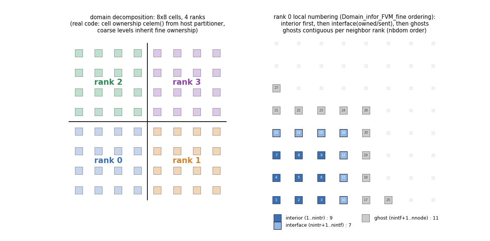
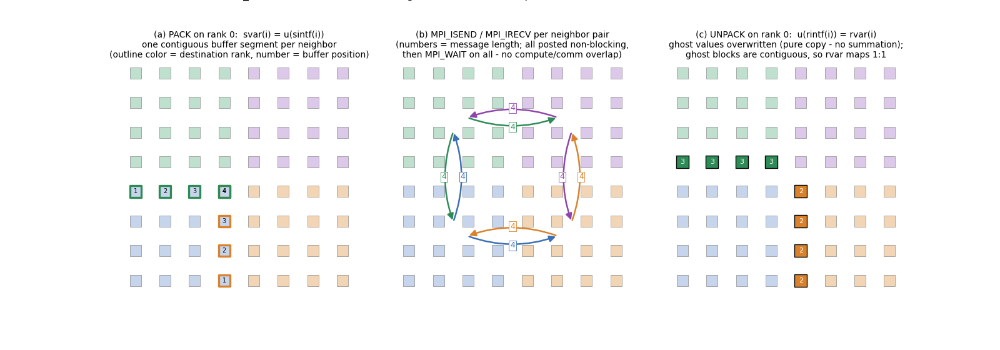
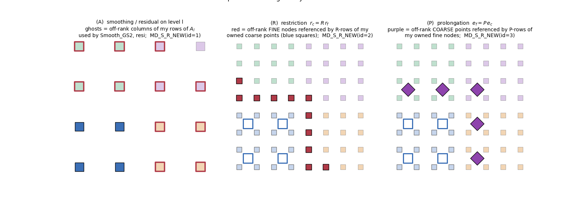
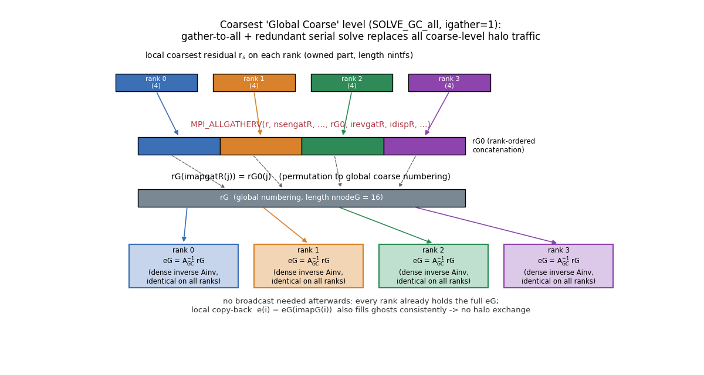
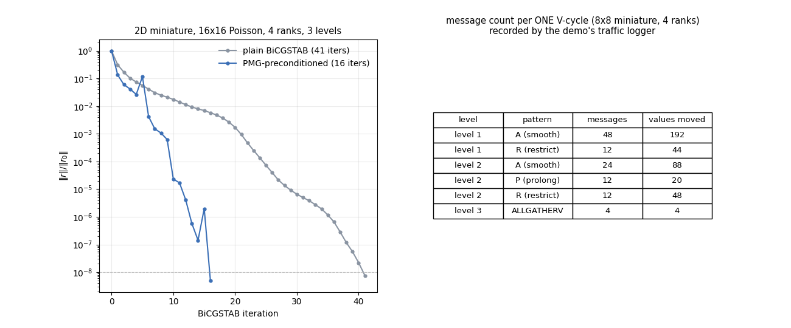

# 04. 병렬화 — 도메인 분할, 데이터 이동, 통신 노드 구성

> 핵심 파일: `Domain_infor_FVM_{fine,coarse,coarsest}.f90`, `Neighbor_node_ARP.f90`,
> `send_receive.f90`, `send_receive_mt.f90`, `send_receive_csr.f90`, `module/MD_MPI.f90`,
> `stiffness_GC.f90`, `SOLVE_GC.f90`, `imapGZ_coarse.f90`

## 4.1 도메인 분할 모델과 노드 분류

- 미지수 = FVM 셀. 소유권 `celem(ie)` = 셀을 소유한 랭크(1-based)로, 호스트(CUPID/METIS) 분할을 그대로 받는다.
- **코어스 레벨은 재분할하지 않는다**: C 점(대표점)은 fine 셀의 소유권을 상속 (`celem1(i) = celem0(imap(i))`, [6_subdomain_infor_mg.f90:440-444](../../code/Source/GMG/6_subdomain_infor_mg.f90#L440-L444)). 따라서 랭크 경계의 기하학적 위치가 전 레벨에서 동일하다.

각 랭크의 로컬 노드는 3분류된다 ([Domain_infor_FVM_fine.f90:80-108](../../code/Source/GMG/Domain_infor_FVM_fine.f90#L80-L108)):

| 구간 (로컬 번호) | 분류 | 의미 |
|---|---|---|
| `1 .. nintr` | interior | 소유, 이웃도 전부 자기 랭크 (통신 무관) |
| `nintr+1 .. nintf` | interface | 소유, 다른 랭크가 필요로 함 (**send 대상**) |
| `nintf+1 .. nnode` | external/ghost | 남이 소유, 내가 수신 (**recv 대상**) |
| `nnode+1 .. nnodegl` | 2층 halo | Galerkin RAP 의 고스트 행 열 인덱스 전용 |

> ⚠️ 변수명 주의: **`nintf` 는 "interface" 가 아니라 "소유 노드 총수(owned)"** 다. 모든 계산 루프가 `do i=1,nintf` 로 도는 이유. `nnode − nintf` = 고스트 수라는 항등식을 코드가 계약처럼 검증한다 ([2_read_mesh_MPI.f90:703-706](../../code/Source/GMG/2_read_mesh_MPI.f90#L703-L706)).

**번호 부여 순서가 통신 성능의 핵심**이다: 고스트는 owned 뒤에, **이웃 랭크별로 연속 블록**으로 배치된다 (`sort` 카운터, [Domain_infor_FVM_fine.f90:186-319](../../code/Source/GMG/Domain_infor_FVM_fine.f90#L186-L319)). 그래서 `rpt` 오프셋이 곧 메모리 연속 구간이 되어 수신 버퍼가 1:1 로 매핑된다.



*그림(2D 미니어처): 왼쪽 = 4-랭크 분할. 오른쪽 = rank 0 의 로컬 번호: interior(1..9) → interface(10..16) → ghost(17..27, 이웃별 블록).*

## 4.2 Halo 교환 자료구조 — `MD_MPI` ([module/MD_MPI.f90](../../code/Source/GMG/module/MD_MPI.f90))

| 변수 | 의미 |
|---|---|
| `nnbd` | 이웃 랭크 수 |
| `nbdom(nnbd)` | 이웃 랭크 번호 (1-based; MPI 호출 시 −1) |
| `spt(nnbd+1)` / `rpt(nnbd+1)` | CSR 식 send/recv 버퍼 오프셋 (i번째 이웃 분량 = `spt(i+1)−spt(i)`) |
| `sintf(·)` | 보낼 **로컬 노드 번호** 리스트 (이웃별 연접) |
| `rintf(·)` | 받을 **로컬 고스트 번호** 리스트 |

송신 리스트는 **수신측 리스트의 전치로 셋업 시 생성**된다 (`snbcnt(jp,ip)=rnbcnt(ip,jp)`, [Domain_infor_FVM_fine.f90:262-276](../../code/Source/GMG/Domain_infor_FVM_fine.f90#L262-L276)) — rank 0 직렬 셋업이 전역 정보를 갖고 있어 가능하며, **런타임에는 인덱스가 전혀 이동하지 않고 값만 이동**한다. 송신자는 수신자가 정한 순서로 패킹하므로 버퍼가 그대로 고스트 블록에 꽂힌다.

## 4.3 런타임 halo 교환 — `send_receive` ([send_receive.f90:1-63](../../code/Source/GMG/send_receive.f90#L1-L63))

```fortran
svar(i) = u(sintf(i))                          ! ① pack (gather)
do i=1,nnbd
   MPI_ISEND(svar(spt(i)), spt(i+1)-spt(i), ..., nbdom(i)-1, tag=1, ...)
   MPI_IRECV(rvar(rpt(i)), rpt(i+1)-rpt(i), ..., nbdom(i)-1, tag=1, ...)
enddo                                          ! ② 전부 non-blocking post
do i=1,nnbd
   MPI_WAIT(send); MPI_WAIT(recv)              ! ③ 전부 wait (오버랩 없음)
enddo
u(rintf(i)) = rvar(i)                          ! ④ unpack (scatter) — 덮어쓰기
```



*그림(2D 미니어처): (a) rank 0 의 패킹 — 이웃별 연속 버퍼 세그먼트(외곽선 색 = 목적지, 숫자 = 버퍼 내 위치). (b) 이웃쌍별 ISEND/IRECV (5점 스텐실이라 fine 레벨엔 대각 이웃 없음). (c) 언팩 — 고스트가 소유 랭크의 값(여기선 rank+1)으로 덮어써짐.*

특성 정리:
- **순수 복사(overwrite) 모델** — additive(누산) 통신은 코드 어디에도 없다. owner-computes 원칙이 일관 적용된다.
- 코어스 레벨용 `send_receive_C` ([send_receive.f90:71](../../code/Source/GMG/send_receive.f90#L71))는 연접 배열([02](02_setup_hierarchy.md) §2.6) 진입점 `ista` 오프셋만 추가된 동일 구현.
- tag 는 항상 1 (호출 내 즉시 wait 이므로 안전), `MPI_WAITALL` 대신 WAIT 루프, 통신-계산 오버랩 없음 — §4.9 개선 여지 참조.

## 4.4 이웃 랭크 발견

직렬 셋업이 전역 소유권을 갖고 있으므로 통신 없이 조회로 해결한다: "ip 가 필요로 하는 외부 노드의 소유자가 jp 면 ip↔jp 를 이웃 등록". `imark` 로 **양방향 대칭 등록을 강제**해 send/recv 쌍이 항상 맞는다 ([Neighbor_node_ARP.f90:31-57](../../code/Source/GMG/Neighbor_node_ARP.f90#L31-L57)). 이 탐색은 `O(np² × cext)` 이고 `(np,np,·)` 3D 배열을 쓰므로 **랭크 수가 크면 셋업이 이차적으로 무거워진다** (§4.9).

## 4.5 세 종류의 통신 패턴: A / R / P

**V-cycle 의 세 연산이 요구하는 고스트 집합이 서로 다르다**는 것이 이 코드 병렬화의 핵심 아이디어다. base 리스트(§4.2)는 세 집합의 합집합으로 만들고(로컬 번호 부여용), 실제 교환은 연산별 최소 부분집합만 수행한다.

| 패턴 | 고스트 집합의 정의 | 언제 교환하나 | 구축 루틴 |
|---|---|---|---|
| **A** | 내 소유 행의 `A_l` 스텐실이 참조하는 off-rank 열 | 스무딩 스윕 직후 / 잔차 직전 | `cext` 1차 채움 ([Domain_infor_FVM_coarse.f90:89-115](../../code/Source/GMG/Domain_infor_FVM_coarse.f90#L89-L115)) |
| **R** | 내 소유 **코어스** 점의 R-행이 참조하는 off-rank **fine** 노드 | 제한 `rc = R·rt` 직전 (rt 에 대해) | `Ext_nodes_R` ([Neighbor_node_ARP.f90:170](../../code/Source/GMG/Neighbor_node_ARP.f90#L170)) |
| **P** | 내 소유 **fine** 노드의 P-행이 참조하는 off-rank **코어스** 점 | 보간 `et = P·e` 직전 (e 에 대해) | `Ext_nodes_P` ([Neighbor_node_ARP.f90:215](../../code/Source/GMG/Neighbor_node_ARP.f90#L215)) |



*그림(2D 미니어처, rank 0 기준): (A) 코어스 레벨 Ac 스텐실 고스트. (R) 소유 코어스 점(파란 외곽선)의 R-행이 요구하는 off-rank fine 노드(빨강). (P) 소유 fine 노드 보간에 필요한 off-rank 코어스 점(보라 다이아몬드). 세 집합의 크기·구성이 다르다 — 합집합 하나로 통신하면 그만큼 낭비다.*

- 최조 레벨은 R 이 없어 A + P 만 구축한다 ([Domain_infor_FVM_coarsest.f90:389-392](../../code/Source/GMG/Domain_infor_FVM_coarsest.f90#L389-L392)).
- 레벨이 내려갈수록 스텐실이 넓어져(RAP) **대각 이웃 등 이웃 랭크 수가 증가**한다. 셋업 버퍼도 레벨에 비례해 키운다 (`nn = ilv*nn`, [Domain_infor_FVM_coarse.f90:125](../../code/Source/GMG/Domain_infor_FVM_coarse.f90#L125)).

### 레벨별 디스패처 `MD_S_R_NEW(id, ilv, ista, vec)` ([send_receive.f90:134](../../code/Source/GMG/send_receive.f90#L134))

레벨별 리스트는 2D 배열 `(·, ilv)` 에 저장되고(`MD_MPI_ARP`: `inbdcA/ibdomcA/isptcA/…` 및 R/P 변형), 디스패처가 `id=1(A), 2(R), 3(P)` 로 골라 `send_receive_C` 를 부른다. V-cycle 내 호출 지점:

| 호출 | id | 벡터 | 목적 |
|---|---|---|---|
| [7_SOLVE_GMG.f90:522](../../code/Source/GMG/7_SOLVE_GMG.f90#L522) | A | e | 하향 GS 스윕마다 |
| [:531](../../code/Source/GMG/7_SOLVE_GMG.f90#L531) | R | rt | 다음 레벨 제한 준비 |
| [:598](../../code/Source/GMG/7_SOLVE_GMG.f90#L598) | A | e | 상향 GS 스윕마다 |
| [:608](../../code/Source/GMG/7_SOLVE_GMG.f90#L608) | P | e | 더 fine 레벨 보간 준비 |

fine 레벨은 디스패처 없이 `sptA/rptA…`(A 패턴)와 `sptR/rptR…`(R 패턴)를 직접 넘긴다 ([:425, :474, :630](../../code/Source/GMG/7_SOLVE_GMG.f90#L425)).

## 4.6 셋업 단계의 행렬/패턴 통신

| 루틴 | 무엇을 교환 | 왜 |
|---|---|---|
| `send_receive_mtf` / `MD_S_R_MT` ([send_receive_mt.f90](../../code/Source/GMG/send_receive_mt.f90)) | **행렬 값 `au` 를 CSR 행 단위로** (2차 포인터 `sia/ria` 로 행별 nnz 구간 패킹) | Galerkin RAP 직전, 고스트 행의 A 계수 필요 ([stiffness_MG.f90:107-121](../../code/Source/GMG/stiffness_MG.f90#L107-L121)). `mt` = matrix (멀티스레드 아님) |
| `send_receive_csr` / `send_receive_csrc` ([send_receive_csr.f90](../../code/Source/GMG/send_receive_csr.f90)) | **고스트 행 열의 좌표(x,y,z)** 를 교환하고 O(nd²) 최근접 매칭으로 `ja` 재정렬 | 소유 랭크가 저장한 열 순서와 수신 랭크의 로컬 번호 순서를 일치시켜, 이후 `au` 행 교환이 위치별로 대응되게 함 (셋업 1회) |

행렬 통신은 base(합집합) 패턴만 사용한다 — V-cycle 핫패스가 아니므로 A/R/P 분리를 하지 않았다.

> **→ 이 행 교환이 RAP 계산과 어떻게 맞물리는지(왜 계산 후 환원이 없는지)는 [06_rap_parallel_example.md](06_rap_parallel_example.md) 에서 1D 수치 예제로 단계별 해설.**

## 4.7 최조 레벨: gather-to-all + 중복 직렬 해

코어스 레벨의 halo 통신(작은 메시지 다수 = 레이턴시 지배)을 **집단 통신 1회**로 대체하는 것이 GC 층의 존재 이유다.



`igather=1` 기본 경로 (런타임, 매 V-cycle):

```
① r(1..nintfs)  --MPI_ALLGATHERV-->  rG0 (랭크순 연접)          # SOLVE_GC.f90:69
② rG(imapgatR(j)) = rG0(j)            (전역 번호로 순열)         # :73-75
③ eG = Ainv·rG   (전 랭크 동일 계산, i_dir=1)                    # SOLVE_EXACT
④ e(i) = eG(imapG(i))                 (로컬+고스트 동시 복원)     # :114-119
```

- 카운트/변위/순열(`irevgatR/idispR/imapgatR`)은 셋업 시 `imap_GATHER` 가 `MPI_ALLGATHER(V)` 로 1회 구축 ([imapGZ_coarse.f90:49-157](../../code/Source/GMG/imapGZ_coarse.f90#L49-L157)). 성립 조건: 소유 노드들이 전역 최조 집합을 정확히 분할(bijection 검증 포함).
- ④ 가 고스트까지 채우므로 **GC 이후 halo 교환이 불필요**하고, 전 랭크가 같은 해를 가지므로 **BCAST 도 불필요**하다.
- 행렬 값 조립도 동일 구조 (`stiffness_GC_all`: `au` ALLGATHERV + `imapgatA` 순열, [stiffness_GC.f90:84-91](../../code/Source/GMG/stiffness_GC.f90#L84-L91)) — 단 이는 RAP 시점(`icase=1`)에만.
- 대안 경로 `igather=0` 은 scatter + `ALLREDUCE(SUM)` (전송량 `nnzG`/`nnodeG`, 제로 패딩 낭비). `i_dir=2` 는 직접해 행을 랭크에 분배 + ALLREDUCE — 직접해의 유일한 병렬화 경로.

## 4.8 V-cycle 1회의 통신 지도 (전체 데이터 이동 요약)

| 구간 | 통신 | 종류 | 횟수 (사이클당) |
|---|---|---|---|
| pre/post Chebyshev (fine) | halo(A-fine) | 근접 P2P | 2 × itergs(1) × icheb(1) |
| fine 잔차 후 | halo(R-fine) on r | 근접 P2P | 1 |
| 하향 레벨 ilv | halo(A-ilv) ×itergs + halo(R-ilv) ×1 | 근접 P2P | Σ_ilv (itergs(ilv)+1) |
| 상향 레벨 ilv | halo(A-ilv) ×itergs + halo(P-ilv) ×1 | 근접 P2P | Σ_ilv (itergs(ilv)+1) |
| fine 보정 후 | halo(A-fine) on u | 근접 P2P | 1 |
| GC 잔차 수집 | `MPI_ALLGATHERV` | 집단 | 1 |
| 사이클 판정 | `MPI_ALLREDUCE` (res) | 집단 | 1 (+초기 res0 1회) |

여기에 BiCGSTAB 외부 반복이 **반복당 ALLREDUCE 5회 + halo(A-fine) 2회**를 추가한다 ([01](01_overview.md) §1.3). 2D 미니어처로 실측한 사이클당 메시지 집계는 아래와 같다 (오른쪽 표):



관찰:
- 메시지 **수**는 fine 레벨 A 패턴(스무딩)이 지배하고, 메시지 **크기**는 레벨이 내려갈수록 급감한다 → 코어스 레벨은 레이턴시 지배 → GC 의 gather-to-all 전환이 정당화된다.
- R/P 패턴은 각각 1회씩만 교환되며 A 와 다른 (더 작은) 집합이다.

## 4.9 특성·한계·개선 여지 (코드 리뷰 관점)

1. **오버랩 없음**: 모든 halo 가 post→즉시 wait. interior(`1..nintr`)/interface(`nintr+1..nintf`) 번호 분리가 이미 되어 있으므로, interior 계산과 통신을 겹치는 개조가 구조적으로 가능하다 (현재 `nintr` 은 미사용).
2. **WAIT 루프**: `MPI_WAITALL` 로 교체 가능 (기능 동일, progress 효율 개선).
3. **핫패스 자동배열**: `send_receive` 의 `svar/rvar`, `MD_S_R_NEW` 의 스택 복사(`(:,ilv)` 열 전체를 매 호출 복사)가 스무딩 루프 안에서 반복된다.
4. **셋업 O(np²)**: 이웃 탐색과 `(np,np,·)` 배열 — 대규모 랭크에서 셋업 병목/메모리 폭증 (np=900 비결정 크래시 이력, LOG C010-3).
5. **잠복 버그**: [2_read_mesh_MPI.f90:460-467](../../code/Source/GMG/2_read_mesh_MPI.f90#L460-L467) 의 복붙 오타로 `nnrecv_m` 가 갱신되지 않음. 현재는 "A/R/P recv ⊆ base recv" 성질 덕에 우연히 안전.
6. **`PAUSE` 잔존**: [send_receive_csr.f90:196](../../code/Source/GMG/send_receive_csr.f90#L196) 등 — MPI 실행 중 hang 유발 가능.
7. GC 중복 해는 랭크 수와 무관한 상수 비용이지만, `nnodeG`(≤ n1_min=100 수준)와 `nlv_glo` 가 커지면 중복 계산·메모리(전 랭크가 전역 패턴 보유)가 부담이 된다 — `ndom` 기반 `nlv_glomax` 자동 선택이 이 트레이드오프의 손잡이.
