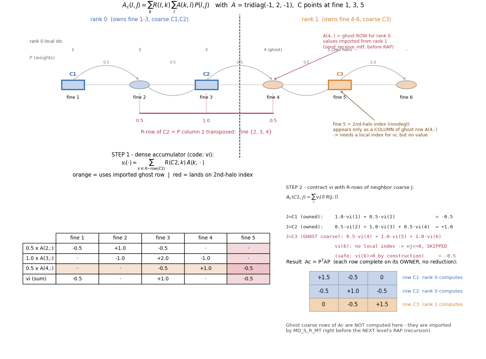
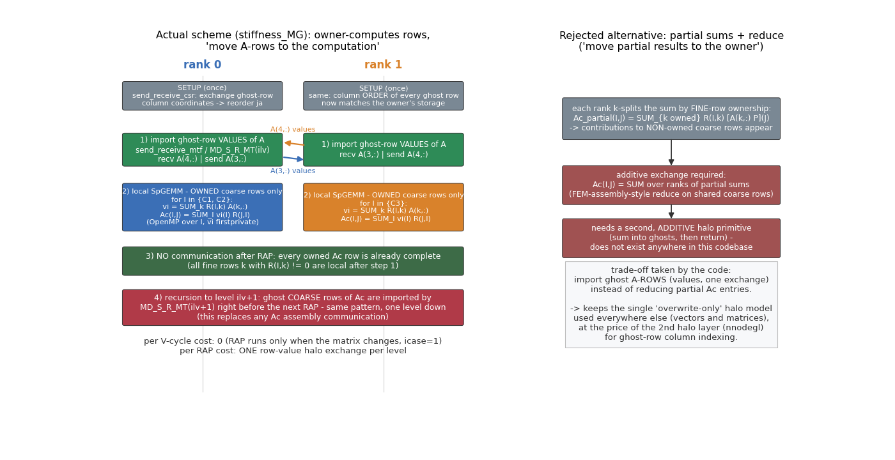

# 06. 병렬 RAP 완전 해부 — 수식·예제 대조

> [02](02_setup_hierarchy.md) §2.5 와 [04](04_parallelization.md) §4.6 의 보충. 대상 코드: `stiffness_MG.f90` (`stiff_coarse_P`), `send_receive_mt.f90`, `send_receive_csr.f90`.
> "RAP 가 정확히 무엇을, 어느 랭크가, 어떤 데이터를 받아서 계산하는가"를 손으로 따라갈 수 있는 1D 예제로 설명한다.

## 6.1 문제 설정: RAP 에서 병렬화해야 하는 것은 무엇인가

Galerkin 코어스 행렬은 (R = Pᵀ 이므로)

$$A_c(I,J) \;=\; \sum_{k} R(I,k)\; \sum_{l} A(k,l)\, P(l,J)$$

여기서 $I, J$ = 코어스 점, $k, l$ = fine 점. 병렬화 관점에서 이 식의 각 인덱스에 **소유권**을 칠해 보면 문제가 명확해진다:

| 인덱스 | 무엇인가 | 어느 랭크에 있나 |
|---|---|---|
| $I$ | 계산할 코어스 **행** | **내가 소유한 것만 계산** (owner-computes). 코어스 점은 그 C-점(fine 노드)의 소유자를 상속하므로 "코어스 행 소유 = fine C-점 소유" |
| $k$ | R-행 $I$ 가 참조하는 fine 점 | 내 소유 C-점의 보간 이웃이므로 대부분 로컬이지만, **랭크 경계의 C-점은 이웃 랭크 소유 fine 점 $k$ 를 참조**한다 → 그 $k$ 의 **A-행 전체가 필요** (여기가 통신 지점) |
| $l$ | 그 A-행 $k$ 의 열 | 고스트 행 $k$ 의 열은 **고스트의 고스트**(2층 halo)까지 뻗는다 → 값은 필요 없고 **로컬 인덱스만** 필요 (`nnodegl` 의 존재 이유) |
| $J$ | 결과 행의 열 (이웃 코어스 점) | 고스트 코어스 점 포함. 그 R-행 패턴은 직렬 셋업이 이미 배포해 둠 — 통신 불필요 |

**핵심 설계 결정**: 합 $\sum_k$ 를 랭크별로 쪼개 부분합을 만들고 나중에 환원(reduce)하는 대신, **필요한 A-행(값)을 소유자에게서 가져와 소유 랭크가 완전한 행을 한 번에 계산**한다. 그래서 RAP 는 "계산 전 행 교환 1회, 계산 후 통신 0회"가 된다.

## 6.2 1D 예제: fine 6점 · 2랭크 · C-점 {1,3,5}

설정 — $A = \mathrm{tridiag}(-1,2,-1)$, C-점은 fine 1, 3, 5 (→ 코어스 C1, C2, C3). F-점 2, 4 는 양쪽 C 에서 1/2 씩, F-점 6 은 C3 하나뿐이라 가중치 1 (injection). rank 0 이 fine 1–3 (→ C1, C2), rank 1 이 fine 4–6 (→ C3) 을 소유.

$$P = \begin{pmatrix} 1&&\\ \tfrac12&\tfrac12&\\ &1&\\ &\tfrac12&\tfrac12\\ &&1\\ &&1 \end{pmatrix},\qquad R = P^{\mathsf T},\qquad A_c = R A P = \begin{pmatrix} 1.5&-0.5&0\\ -0.5&1.0&-0.5\\ 0&-0.5&1.5 \end{pmatrix}$$

이제 **rank 0 이 자기 소유 행 $A_c(C2,\cdot)$ 를 계산하는 과정**을 코드 그대로 따라간다. (아래 그림의 모든 수치는 스크립트가 numpy 로 계산·검증한 값이다.)



### STEP 0 — 통신: 고스트 행 값 수입 (RAP 직전, [stiffness_MG.f90:107-121](../../code/Source/GMG/stiffness_MG.f90#L107-L121))

C2 의 R-행은 fine **{2, 3, 4}** 를 참조한다 (가중치 0.5, 1, 0.5). fine 2, 3 은 rank 0 소유지만 **fine 4 는 rank 1 소유** — 즉 rank 0 은 $A(4,:)$ 행 전체의 **값**이 필요하다. 이것이 `send_receive_mtf`(fine 레벨) / `MD_S_R_MT(ilv)`(코어스 레벨)가 하는 일이다: 벡터 halo 와 같은 `sintf/rintf` 리스트 위에 행별 nnz 구간 포인터(`sia/ria`)를 얹어 **CSR 행 단위로 au 값을 교환**한다.

- 패턴(열 인덱스 `ja`)은 셋업 때 이미 로컬에 있다. 다만 rank 1 이 행 4 를 저장한 **열 순서**와 rank 0 의 로컬 번호 순서가 다를 수 있으므로, 셋업 시 1회 `send_receive_csr` 이 열의 좌표를 교환해 `ja` 를 소유자 순서로 재정렬해 둔다 — 이후 값 교환은 위치별 1:1 대응으로 복사만 하면 된다.
- 이때 $A(4,:)$ 의 열은 {3, 4, **5**} 인데 fine 5 는 rank 0 의 1층 halo 에도 없다. **값은 전혀 필요 없고** 누산기 주소로 쓸 **로컬 인덱스만** 필요하므로, 셋업이 2층 halo(`nnode+1..nnodegl`)에 번호만 부여해 둔다.

### STEP 1 — 밀집 누산기 vi ([stiffness_MG.f90:319-328](../../code/Source/GMG/stiffness_MG.f90#L319-L328))

$$v_i(\cdot) = \sum_{k \in \{2,3,4\}} R(C2,k)\, A(k,\cdot) = 0.5\,A(2,\cdot) + 1.0\,A(3,\cdot) + 0.5\,A(4,\cdot)$$

| | fine 1 | fine 2 | fine 3 | fine 4 | fine 5 |
|---|---|---|---|---|---|
| 0.5·A(2,:) | −0.5 | +1.0 | −0.5 | · | · |
| 1.0·A(3,:) | · | −1.0 | +2.0 | −1.0 | · |
| 0.5·A(4,:) **(수입한 고스트 행)** | · | · | −0.5 | +1.0 | **−0.5** |
| **vi** | −0.5 | 0 | +1.0 | 0 | **−0.5** |

`vi` 는 로컬 fine 전체 크기(`nnodegl`)의 밀집 배열이고, OpenMP `firstprivate` 로 스레드마다 사본을 가져 코어스 행 $I$ 에 대해 스레드 병렬로 돈다. fine 5 열에 값이 쌓이는 것(−0.5)이 바로 2층 halo 인덱스가 필요한 순간이다.

### STEP 2 — R-행과의 축약 ([stiffness_MG.f90:332-350](../../code/Source/GMG/stiffness_MG.f90#L332-L350))

$A_c$ 패턴 행 $C2$ 의 각 열 $J$ 에 대해 $A_c(C2,J) = \sum_l v_i(l)\, R(J,l)$ (R=Pᵀ 이므로 $R(J,l) = P(l,J)$):

- $J=C1$ (소유): $1{\cdot}v_i(1) + 0.5{\cdot}v_i(2) = \mathbf{-0.5}$
- $J=C2$ (소유): $0.5{\cdot}v_i(2) + 1{\cdot}v_i(3) + 0.5{\cdot}v_i(4) = \mathbf{+1.0}$
- $J=C3$ (**고스트 코어스**): $0.5{\cdot}v_i(4) + 1{\cdot}v_i(5) + 1{\cdot}v_i(6) = \mathbf{-0.5}$
  - $C3$ 의 R-행 패턴(fine {4,5,6})은 셋업이 배포해 둬서 로컬에 있다.
  - fine 6 은 로컬 인덱스가 없다(`nj(l) ≤ 0`) → **skip** ([stiffness_MG.f90:343-346](../../code/Source/GMG/stiffness_MG.f90#L343-L346)). 이것이 안전한 이유: $v_i(l) \ne 0$ 인 $l$ 은 반드시 (수입한 행 포함) 로컬 A-행들의 열이고, 그 열들은 전부 `nnodegl` 안에 번호가 있다. 인덱스가 없는 열은 $v_i=0$ 이 보장되므로 건너뛰어도 값이 새지 않는다.

같은 시각 rank 1 은 자기 소유 행 $A_c(C3,\cdot)$ 를 (rank 0 에게서 $A(3,:)$ 를 수입해) 독립적으로 계산한다. **각 행이 소유 랭크에서 완결되므로 계산 후 환원 통신이 전혀 없다.**

## 6.3 왜 이 방식인가 — 대안과의 비교



$\sum_k$ 를 fine 행 소유권으로 쪼개는 대안(각 랭크가 부분합 $A_c^{partial}$ 을 만들고 공유 코어스 행에서 합산)은 FEM 조립처럼 **additive(누산형) halo 교환**을 요구한다. 이 코드베이스의 halo 는 벡터든 행렬이든 전부 **덮어쓰기(overwrite) 단일 모델**이라 ([04](04_parallelization.md) §4.3), additive 프리미티브 자체가 존재하지 않는다. 대신:

| | 실제 방식 (행 수입) | 대안 (부분합 + reduce) |
|---|---|---|
| RAP 전 통신 | 고스트 A-행 값 1회 교환 | 없음 |
| RAP 후 통신 | **없음** | 공유 코어스 행 누산 교환 |
| halo 모델 | 기존 덮어쓰기 모델 재사용 | 새 additive 프리미티브 필요 |
| 추가 비용 | 2층 halo 인덱싱 (`nnodegl`) | 부분합 버퍼 + 중복 nnz 병합 |

교환량도 유리한 편이다: 수입할 고스트 행 수 = 1층 halo 크기이고, 부분합 방식이 교환해야 할 코어스 행 엔트리 수와 대체로 같은 차수이면서 왕복(누산→회신)이 없다.

## 6.4 재귀 구조: "고스트 Ac 행은 언제 채워지나"

위 계산에서 rank 0 은 $A_c$ 의 행 C3 (고스트 코어스 행)을 만들지 않았다. 그런데 다음 레벨 RAP($A_{cc} = R_2 A_c P_2$)에서는 rank 0 이 자기 소유 레벨-3 행을 만들 때 **$A_c$ 의 고스트 행**이 필요해진다. 답은 재귀다:

```
for ilv = 1 .. nlevel-1:                       # stiffness_MG.f90 레벨 루프
    (통신) 레벨 ilv 고스트 행 값 수입            # ilv=1: send_receive_mtf / ilv≥2: MD_S_R_MT(ilv)
    (계산) 소유 코어스 행만 RAP → A_{ilv+1}     # stiff_coarse_P
```

즉 **"레벨 ilv 의 RAP 직전 행 교환"이 곧 "레벨 ilv−1 RAP 가 만들지 않은 고스트 행을 채우는 통신"**이다. 이 행 교환은 base(A∪R∪P 합집합) 리스트를 쓴다 — RAP 는 행렬이 바뀔 때(`icase=1`)만 실행되는 비-핫패스라 A/R/P 분리 최적화를 하지 않았다.

## 6.5 수식 ↔ 코드 기호 대응표

| 수식 | 코드 | 위치 |
|---|---|---|
| $R(I,k)$ (행: 코어스, 열: fine) | `Xrest(iar(I):iar(I+1)-1)`, 열 `jar` | `MD_MG_matrix` |
| $P(l,J)$ | `Xintp(iai(l):...)`, 열 `jai` — RAP 에선 $R(J,l)$ 로 접근 | 〃 |
| $A(k,\cdot)$ 고스트 행 값 | `au`(fine) / `au1`(레벨 ilv) — 교환 후 | [stiffness_MG.f90:113-118](../../code/Source/GMG/stiffness_MG.f90#L113-L118) |
| 행별 버퍼 구간 | `sia/ria` (`siaf/riaf`, `isiac/iriac`) | [send_receive_mt.f90:40-50](../../code/Source/GMG/send_receive_mt.f90#L40-L50) |
| $v_i$ 누산기 | `vi(nnodegl)`, OpenMP `firstprivate` | [stiffness_MG.f90:309-328](../../code/Source/GMG/stiffness_MG.f90#L309-L328) |
| 소유 행 한정 | `DO I = 1, nintf1` | [stiffness_MG.f90:311](../../code/Source/GMG/stiffness_MG.f90#L311) |
| $l$ 의 로컬 인덱스 (없으면 skip) | `nj(l) ≤ 0 → CYCLE` | [stiffness_MG.f90:343-346](../../code/Source/GMG/stiffness_MG.f90#L343-L346) |
| $A_c$ 패턴 행 $I$ 의 열 집합 | `ja1(ia1(I):ia1(I+1)-1)` (셋업 시 `connectivity_coarse` 가 생성) | [connectivity_coarse.f90](../../code/Source/GMG/connectivity_coarse.f90) |
| 열 순서 정합 (셋업 1회) | `send_receive_csr(c)` — 좌표 매칭으로 `ja` 재정렬 | [send_receive_csr.f90](../../code/Source/GMG/send_receive_csr.f90) |

## 6.6 자주 헷갈리는 점 (FAQ)

**Q1. 고스트 코어스 점 C3 의 R-행이 왜 rank 0 로컬에 있나? 통신한 적 없는데.**
R/P 는 rank 0 직렬 셋업이 전역으로 만들고 각 랭크 몫(고스트 행 포함)을 잘라 배포한다 ([02](02_setup_hierarchy.md) §2.1). 런타임에 P/R 의 패턴·값은 불변이므로 다시 통신할 일이 없다. 매번 바뀌는 것은 A 의 **값**뿐이고, 그래서 RAP 직전 교환도 값만 이동한다.

**Q2. 스무딩에는 고스트 "값"(벡터)만 필요한데 RAP 에는 왜 고스트 "행"(행렬)이 필요한가?**
스무딩 $u_i \mathrel{+}= (b_i - \sum_j a_{ij} u_j)/a_{ii}$ 는 내 소유 행 $i$ 의 계수만 쓰고 이웃 **값** $u_j$ 만 빌린다. 반면 RAP 의 $\sum_k R(I,k) A(k,\cdot)$ 는 이웃이 소유한 **행 전체의 계수**가 피연산자다. "벡터 halo vs 행렬(행) halo"의 차이.

**Q3. 2층 halo(`nnodegl`)는 왜 값 없이 인덱스만 있으면 되나?**
STEP 1 에서 fine 5 는 오직 **누산기의 주소**로만 쓰인다 ($v_i(5) \mathrel{+}= 0.5 \cdot A(4,5)$ — 값 $A(4,5)$ 는 수입한 행 안에 있다). STEP 2 에서 $v_i(5)$ 를 읽을 때 곱해지는 $R(C3,5)$ 도 셋업이 배포한 로컬 데이터다. fine 5 의 미지수 값 $u_5$ 는 어디에도 등장하지 않는다.

**Q4. `nj ≤ 0` skip 으로 값이 누락되지 않는 이유는?**
$v_i(l) \ne 0$ ⇔ $l$ 이 (수입 행 포함) 로컬 보유 A-행들의 열 ⇔ $l$ 은 `nnodegl` 안에 번호가 있음. 대우로, 번호가 없는 $l$ 은 $v_i(l) = 0$ 이 구조적으로 보장된다. skip 은 "0 을 더하지 않는 것"일 뿐이다.

**Q5. 그래도 합이 "완전"한가? rank 1 도 C2 에 기여해야 하는 것 아닌가?**
아니다 — 그것이 이 방식의 요점이다. $A_c(C2,\cdot)$ 의 $\sum_k$ 에 등장하는 모든 $k$ (= C2 의 R-행 이웃 {2,3,4})의 A-행이 STEP 0 이후 rank 0 에 **전부** 있으므로, rank 0 혼자 합을 끝까지 계산한다. rank 1 은 부분 기여를 만들지 않는다(부분합 방식이 아님). 검산: 위 예제의 rank 0 결과 (−0.5, +1.0, −0.5) 는 전역 직렬 $P^{\mathsf T}AP$ 의 2행과 정확히 일치한다.
